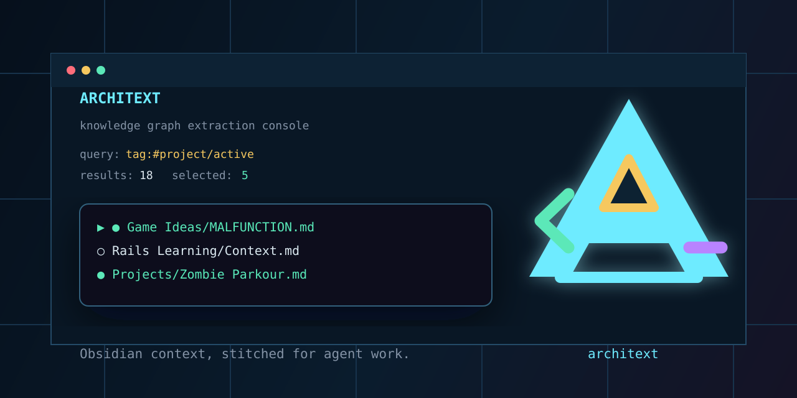

# ARCHiTEXT

<p align="center">
  
  <br>
  <b>The bridge between markdown notes and LLMs.</b>
  <br>
  <i>A high-performance Ruby TUI for context stitching.</i>
</p>

<p align="center">
  <a href="https://github.com/CanPixel/ARCHiTEXT/actions/workflows/ci.yml">
    
  </a>
  
  <a href="https://clickgems.clickhouse.com/dashboard/architext">
    
  </a>
  <a href="https://rubygems.org/gems/architext">
    
  </a>
</p>

<p align="center">
  
  <a href="https://rubygems.org/gems/architext">
    
  </a>
  <a href="https://rubygems.org/gems/architext">
    
  </a>
  <a href="LICENSE">
    
  </a>
</p>

---




As LLM context windows grow, the way we feed them data **needs to scale**.

Modern AI agents thrive on context, but gathering that context manually from sprawling markdown folders is tedious. ARCHiTEXT transforms this process into a seamless, visual experience. It allows you to search, filter, and "stitch" multiple notes into a single, structured Markdown bundle that agents can consume immediately.

# Welcome to ARCHiTEXT!

`ARCHiTEXT` is a standalone Ruby TUI for stitching markdown notes into an LLM-friendly context bundle. By default it searches the current folder recursively for `.md` and `.markdown` files, while still offering an optional Obsidian CLI source for users who want vault-name resolution.

## 🚀 Quick Start

```sh
# Start the interactive search and selection flow
architext
```

ARCHiTEXT will search markdown files in the current folder, ask for a search query, then open a picker where you can select notes and copy the stitched context bundle to your clipboard.

Common next steps:

```sh
# Search with a specific query
architext --query "game"

# Search a specific folder
architext --root ~/Notes --query "project"

# Print the bundle instead of copying it
architext --query "tag:#project/active" --all --stdout

# Use Obsidian CLI mode explicitly
architext --source obsidian --vault "Main Vault" --query "Ideas"
```

## ✨ Features

- **Visual Picker:** Interactively select notes using a high-performance ANSI TUI.
- **Source-Aware UX:** Active folder or Obsidian vault is always visible in the TUI, with inline source switching.
- **Native Markdown Search:** Search any folder containing `.md` or `.markdown` files without opening Obsidian.
- **Context Stitching:** Automatically bundles selected notes into a single Markdown file.
- **LLM Ready:** Output is formatted specifically for easy consumption by AI agents.
- **No Dependencies:** Built-in ANSI-based TUI logic (no complex visual gems required).
- **Cross-Platform Clipboard:** Uses native clipboard commands on macOS, Windows, and Linux.

## 📦 Installation

### Using RubyGems

```sh
gem install architext
architext --version
```

### Uninstall

```sh
gem uninstall architext
```

### From Source

```sh
git clone https://github.com/CanPixel/ARCHiTEXT.git
cd ARCHiTEXT
./bin/setup
ruby bin/architext --version
gem build architext.gemspec
gem install ./architext-*.gem
```

## ⚙️ Configuration

Architext does not require Obsidian for normal use. Native mode searches markdown files directly under the current folder or a folder passed with `--root`.

Obsidian CLI integration remains available as an optional source. Use it when you want Obsidian vault-name or vault-id resolution.

### Supported Platforms

- **macOS:** Fully supported (tested in CI).
- **Windows:** Native terminal support (PowerShell/Windows Terminal) with `clip` clipboard integration.
- **Linux:** Native terminal support with clipboard integration via `wl-copy`, `xclip`, or `xsel`.

### Optional Obsidian CLI Path

If you use `--source obsidian` and the CLI is not in your `PATH`, set the `ARCHITEXT_OBSIDIAN` environment variable:

```sh
export ARCHITEXT_OBSIDIAN="/path/to/obsidian"
```

PowerShell:

```powershell
$env:ARCHITEXT_OBSIDIAN = "C:\path\to\obsidian.exe"
```

## 🛠 Usage

```sh
# Basic interactive search
architext

# Search with a specific query
architext --query "Zombie Parkour"

# Search a specific markdown folder
architext --root ~/Notes --query "project"

# Output directly to stdout (useful for piping)
architext --query "tag:#ctx/current" --all --stdout | gemini "Summarize this"

# Use Obsidian CLI mode with a specific vault
architext --source obsidian --vault "Main Vault" --query "Ideas"

# Legacy shorthand: --vault implies --source obsidian
architext --vault "Main Vault" --query "Ideas"

# Set a persistent default Obsidian vault
architext --set-default-vault "Main Vault"

# Clear the persistent default Obsidian vault
architext --clear-default-vault

# Check exactly which executable version is running
architext --version

# Print source diagnostics before searching
architext --diagnose

# Skip the picker and include all results
architext --query "tag:#project/active" --all --stdout
```

### Source Selection Behavior

- Native mode is the default and uses the current working directory as the markdown root.
- `--root PATH` sets the native markdown root for the current run.
- `--source native|obsidian` chooses the source explicitly.
- `--vault` sets the Obsidian vault only for the current run and implies `--source obsidian`.
- `--set-default-vault` stores a persistent default vault for future Obsidian-mode runs.
- At the search prompt, type `v` to open source configuration mode.
- Press `v` in the TUI selection screen to change source inline for the current session.
- Startup diagnostics show native root and markdown file count, or Obsidian CLI details when Obsidian mode is active.

### Native Search Syntax

- Empty query lists all markdown files under the active root.
- Plain terms match case-insensitively against relative paths or file content.
- Quoted phrases match literally.
- `tag:foo` and `tag:#foo` match markdown tags such as `#foo` and nested tags such as `#foo/bar`.
- `path:term` and `file:term` match relative paths.
- Multiple tokens are AND-matched.

### Search Prompt Controls

| Input | Action |
| --- | --- |
| `enter` | Run search with default query |
| `v` | Open source configuration screen |
| `q` | Quit |

### TUI Controls

| Key | Action |
| --- | --- |
| `↑`/`k`, `↓`/`j` | Move selection |
| `space` | Toggle selection for current note |
| `a` | Toggle all visible notes |
| `/` | Filter current results |
| `n` | Start a new markdown search |
| `v` | Set/change active source |
| `enter` | Confirm and bundle selected notes |
| `q` | Return to search prompt |

## 🔍 Troubleshooting

### Obsidian CLI Not Found
This only applies when running with `--source obsidian` or `--vault`. If you see an error about `obsidian` command not found:
1. Ensure the Obsidian desktop app is installed.
2. Verify that you have installed the `obsidian` CLI tool.
3. Check if `obsidian` is in your `PATH` by running `which obsidian` (macOS/Linux) or `where obsidian` (Windows).
4. If you previously exported `OBSCTX_OBSIDIAN`, rename it to `ARCHITEXT_OBSIDIAN`.

### Command Not Found After Gem Install
If `gem install architext` succeeds but `architext` is not found, your Ruby executable directory is not on your shell `PATH`.

1. Find RubyGems executable directory:
   - `gem env | grep "EXECUTABLE DIRECTORY"`
2. Add that directory to your shell `PATH` (for `zsh`, update `~/.zshrc`).
3. Restart your shell and verify:
   - `which architext`
   - `architext --version`

### No Results But Notes Exist
- Verify the active source shown in the TUI header.
- In native mode, confirm the current folder or `--root` contains markdown files.
- At the search prompt, type `v` to open source configuration.
- In selection, use `v` to switch root or Obsidian vault and rerun the query.
- Run `architext --diagnose` to print the active source, native root, markdown count, and Obsidian details when applicable.

### Clipboard Issues
Architext auto-detects clipboard tools:
- macOS: `pbcopy`
- Windows: `clip` (fallback: PowerShell `Set-Clipboard`)
- Linux: `wl-copy`, `xclip`, or `xsel`

If none are available, run with `--stdout` and pipe output to your preferred clipboard manager.

## 📜 License

Architext is released under the [MIT License](LICENSE).
